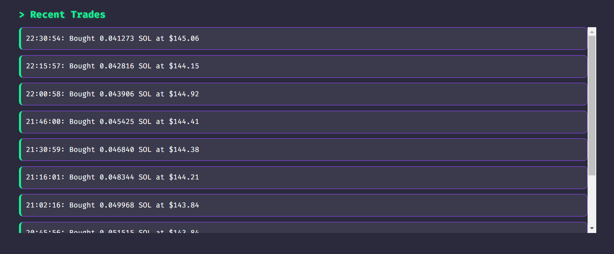
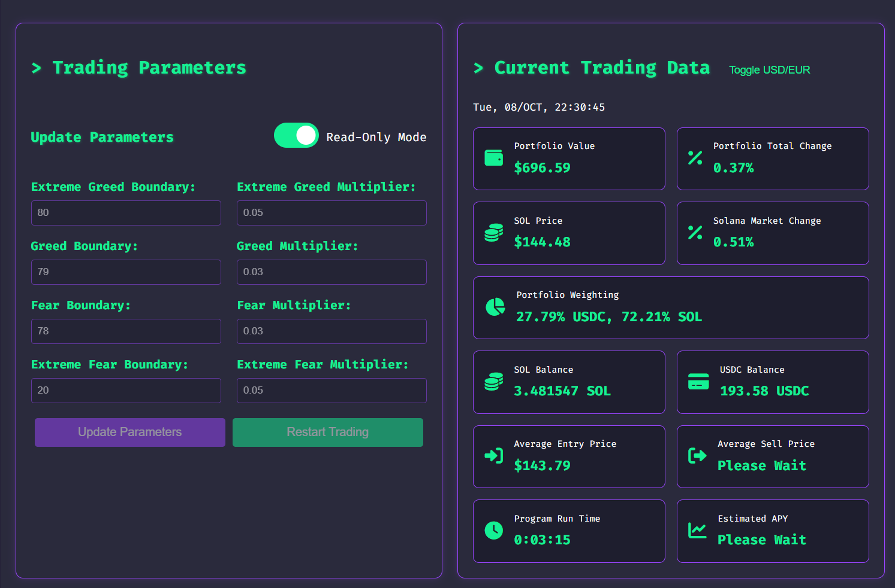

# PulseSurfer: Solana Fear and Greed Index Trader 🏄‍♂️🌊


[](https://twitter.com/spuddya7x)

[Join our Discord community](https://discord.gg/H5MCsYjckc) to discuss PulseSurfer, get support, and stay updated on the latest developments.


PulseSurfer is an automated trading bot that surfs the waves of market sentiment to trade SOL/USDC on the Solana blockchain. By leveraging the Fear and Greed Index, PulseSurfer aims to capitalize on market emotions and make informed trading decisions.

  

## 🚀 Features

  

- 📊 Real-time trading based on the Solana Fear and Greed Index

- 💼 Automated SOL/USDC trading on Solana

- 🎛️ Customizable sentiment boundaries and trading multipliers

- 📈 Live portfolio tracking and performance metrics

- 🖥️ Web-based dashboard for easy monitoring and configuration

- 🔒 Secure, password-protected access to the trading interface

  

## 🛠️ Setup

  

### Prerequisites

  

- Node.js (v14 or later)

- npm (v6 or later)

- A Solana wallet with SOL and USDC

  

### Installation

  

1. Clone the repository:

```

git clone https://github.com/Spuddya7x/pulsesurfer.git

cd pulsesurfer

```

  

2. Install dependencies:

```

npm install

```

  

3. Run the bot once with ```node surf```. This will generate you a .env file.


Edit the `.env` file and fill in your:

-  `PRIVATE_KEY`: Your Solana wallet private key

-  `RPC_URL`: Your Solana RPC URL

-  `ADMIN_PASSWORD`: Password for accessing the web interface

-  `PORT`: Port for the web server (default is 3000)

  

4. Configure your trading parameters in `settings.json`:

```json

{

"SENTIMENT_BOUNDARIES": {

"EXTREME_FEAR": 20,

"FEAR": 40,

"GREED": 60,

"EXTREME_GREED": 80

},

"SENTIMENT_MULTIPLIERS": {

"EXTREME_FEAR": 0.5,

"FEAR": 0.3,

"GREED": 0.3,

"EXTREME_GREED": 0.5

},

"DEVELOPER_TIP_PERCENTAGE": 0 // // In percent, 0 = no tip. This is added to the 0.05% fixed fee.
}

```

  

## 🏃‍♂️ Running PulseSurfer

  

1. Start the trading bot and web server:

```

node surf.js

```

  

2. Open your web browser and navigate to `http://localhost:3000` (or your configured port).

  - Alternatively, you can port forward your selected port and use the machines Public IPv4 Address to connect remotely. You can run this program on a very lightweight Virtual Private Server, and connect remotely via the WebUI.

3. Log in using the `ADMIN_PASSWORD` you set in the `.env` file.

  

## 📊 How It Works

  

PulseSurfer operates on a simple yet effective principle:

  

1.  **Data Collection**: The bot fetches the current Solana Fear and Greed Index every 15 minutes (configurable).

  

2.  **Sentiment Analysis**: Based on the index value, the market sentiment is categorized as:

- Extreme Fear (0-20)

- Fear (21-40)

- Neutral (41-60)

- Greed (61-80)

- Extreme Greed (81-100)

  

3.  **Trading Decision**:

- In fear markets (Extreme Fear or Fear), the bot buys SOL.

- In greed markets (Greed or Extreme Greed), the bot sells SOL.

- In neutral markets, the bot holds its position.

  --Later, there will be further logic to enhance profitability, based upon sentiment.

4.  **Trade Execution**: The trade amount is determined by the current balance and the sentiment multiplier. Trades are executed through the Jupiter aggregator for best prices.

  

5.  **Portfolio Tracking**: After each trade, the bot updates the portfolio balance and calculates performance metrics.

  

## 🎛️ Configuration

  

You can adjust the trading parameters through the web interface:

  

-  **Sentiment Boundaries**: Adjust the index ranges for each sentiment category.

-  **Sentiment Multipliers**: Set the percentage of balance to trade for each sentiment.

  

## 📊 Dashboard

  

The web dashboard provides real-time information:

  

- Current Fear and Greed Index

- Recent trades

- Portfolio value

- Realized and unrealized P&L

- SOL and USDC balances





  

## ⚠️ Disclaimer

  

Trading cryptocurrencies carries a high level of risk and may not be suitable for all investors. The high degree of leverage can work against you as well as for you. Before deciding to trade cryptocurrencies, you should carefully consider your investment objectives, level of experience, and risk appetite. The possibility exists that you could sustain a loss of some or all of your initial investment and therefore you should not invest money that you cannot afford to lose.

  

## 📜 License

  

This project is licensed under the MIT License - see the [LICENSE](LICENSE) file for details.

  

## 🤝 Contributing

  

Contributions, issues, and feature requests are welcome! Feel free to check [issues page](https://github.com/your-username/pulsesurfer/issues).

  

## 👨‍💻 Author

  

**SpuddyA7X**

  

- GitHub: [@SpuddyA7X](https://github.com/SpuddyA7X)

- Twitter: [@SpuddyA7X](https://twitter.com/SpuddyA7X)

  

## 🌟 Show your support

  

Give a ⭐️ if this project helped you!

  

---

  

Happy trading with PulseSurfer! 🏄‍♂️🌊
